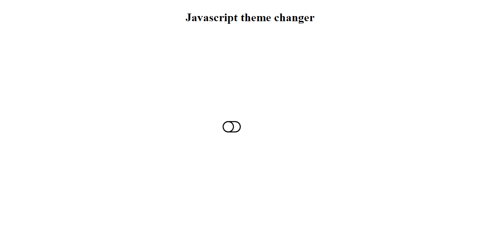
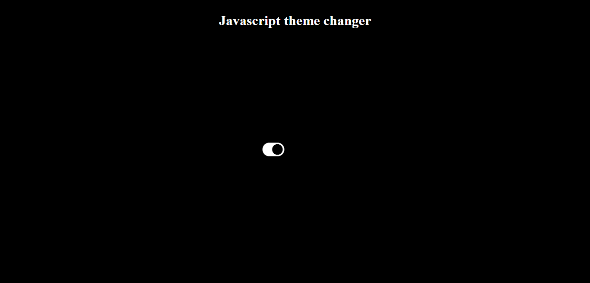

## Javascript Theme Changer

### Hello, I am Dipanshu Shukla

I have build Theme Changer with the help of `HTML`, `CSS` and `JavaScript`.

It helps to change the theme of the page by clicking on the toggle button.

``` Learning Key points of Javascript```
- This project includes the use of adding the class with classList.
  
This is the live link of the project.

Checkout Here [Live Link](https://dp-themechanger.netlify.app)

``Light Mode``



```Dark Mode```



